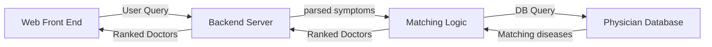

README.md
BERT-NER-Jaccard
database
documentation
mayo_scraper
scrapers
web
.gitignore
CS 410 FA22 Progress Report 2022-11-13.pdf**UIUC MCS Fall 2022: CS410 Final Project** 

**Team Pinto Beans**
# PhysicianSearch 


## Software Components

### 1. Web Scrapers
Code for scraping individual websites is under `./scrapers` directory.

This project uses the following python libraries for scraping websites: 
1. [beautifulsoup](https://pypi.org/project/beautifulsoup4/)
2. [selenium](https://pypi.org/project/selenium/)

The web scrapers use the following data source: 
1. [University of Chicago Medical Center](https://www.uchicagomedicine.org/find-a-physician)
2. [University of Illinois Hospital](https://hospital.uillinois.edu/find-a-doctor)
3. [Northwestern Medicine](https://www.nm.org/doctors)
4. [WebMd](https://www.webmd.com/)
5. [Cook County Health (John H Stroger Jr. Hospital of Cook County)](https://cookcountyhealth.org/about/physicians-directory/)


### 2. Database
All documents are parsed into json and stored in mongodb using [pymongo](https://pypi.org/project/pymongo/). 

After importing data into mongodb, it was cleaned, and the specialties from the two different types of data was standardised using [difflib](https://docs.python.org/3/library/difflib.html). The script can be found within the `database` directory. 

### 3. Backend
Team members tested different options for the backend language models for retrieving patient symptoms. We opted to implement TF-IDF due to its simplicity and performance. The remaining methodologies/functionalities (including BERT embeddings) were implemented independently but ultimately not incorporated in the final version of the web application. Potential follow-on work would explore opportunities to improve upon the application's performance by incorporating BERT embeddings (in part or in whole) to assist the algorithm in selecting appropriate medical conditions and/or their corresponding medical specialties. Code for these explorations is under `./BERT-NER-Jaccard` directory. 
#### BERT Embeddings/NER 

##### Description 
1. Use BERT NER to extract symptom keywords (https://huggingface.co/d4data/biomedical-ner-all)
2. Convert symptoms to embeddings using a pre-trained clinical BERT(https://huggingface.co/GanjinZero/UMLSBert_ENG)
3. Apply cosine-similarity function to evaluate user symptom input (converted to BERT embeddings similar to step 2.) against the converted embedding vector space


##### Testing ##### 
To test the performance of this model, we used GPT-3 `text-davinci-002` model to generate pseudo test data of patient descriptions of each of the diseases in the scraped Mayo disease-to-symptoms mapping.

#### Jaccard Similarity
1. Convert the strings of user inputs, which are the symptoms to a list. 
2. Convert the symtoms extracted from Mayoclinic to a list. 
3. Apply Jaccard similarity to the first and second list to measure the overlap to predict the most likely disease that the patient is having. 

##### Testing ##### 
There are a total of 536 test inputs in the “UserInputSymptoms.plk” file. If we restrict the match to be only 1, we got 69 right out of the 536 inputs, which is about 12.87% accuracy for Jaccard similarity. When we restrict the match to be 5 or 10 of the highest similarity, the accuracy will rise.


### 4. Web Server and Backend Implementation



As shown in the future above, the backend component of the web application uses text retrieval methodologies at several stages. First, a user's query - a description of medical symptoms - is accepted and validated via the UI (webpage open text field). After preprocessing, the query is compared to the database to determine the medical condition or disease most strongly associated with this description (a unigram bag-of-words model with TF-IDF weighting is the core algorithm used in this step). 

Each medical condition, which was web scraped from publicly-available Mayo Clinic data, corresponds to one or more medical specialties (dermatology, oncology, cardiology, and so on); the medical specialties that corresponded to the top condition were used in the text retrieval process to select and return appropriate doctors. A similar algorithm was used to retrieve doctors: doctor specialties and condition specialities were represented as unigram bag-of-words models, again with TF-IDF weighting, and a similarity function (dot product) was used to compare specialty vectors in a pairwise manner, resulting in a ranked list of doctors. The application's front-end (UI) then returns a subset of the highest-ranked doctors to the user.

### 5. Web Front End

The Web Front End has been built within the tornado framework (which powers the backend server as well) using jinja templating and standard HTML libraries e.g. bootstrap. It sends user queries to the backend server, and then displays the HTML returned, which contains the results. 

## Software Usage
### Using the web application via browser

The web application is running on a remote server and is accessible via the following public IP address: **35.209.9.96** (application end users should not need SSH access to the server, but if so, please email sethac3@illinois.edu with an RSA public key and an explanation of why access is needed). The server will be shut down after the semester has ended.

When the website loads, you should see a simple one-page site with an open text field. Type your symptoms into this field and hit "enter" - the application will return a list of Chicago-area doctors whose specialties best match the most likely condition associated with those symptoms.

**As an end user, the source code does not need to be installed locally - all package dependencies are installed and configured on the remote server, which is exposed via its public IP address. The remaining instructions (below) are only provided for documentation purposes and if users have an unpredicted need to access the project server directly.**

### Connecting to the database via SSH forwarding (if needed)

The MongoDB database contains approx. 3,300 doctor profile records and 500 medical condition records, which were web scraped from publicly-available websites such as the Mayo Clinic. The web application uses this data for text retrieval purposes; however, if needed, you can access the database directly as follows:

1. Ensure your public SSH key has been added to the remote server (email sethac3@illinois.edu if access is needed)
2. Set up ssh forwarding via the following command:

```
ssh -L 27017:127.0.0.1:27017 -i <path_to_priv_key> 35.209.9.96
```

3. Use your favourite mongodb client to connect to `mongodb://localhost:27017`


### Connecting to the database via CLI (if needed)

1. Ensure your public SSH key has been added to the remote server (email sethac3@illinois.edu if access is needed)
2. Use the following commands to SSH into the server, access the database, and run commands against MongoDB:


```
ssh -i <path_to_priv_key> 35.209.9.96

mongo
show dbs

use expert_search

db.physicians.count()
```


## Contributors

| Name   |      Username      |   
|:----------:|:-------------:|
| Shengyuan Pan |  pan43 (Team Captain)| 
| Jia Lin Cheoh | jcheoh2 |
| Seth Cattanach |  sethac3 | 
| Akshat Agarwal | akshata4 |
| Arindam Saha |  saha2 |

## Additional Project Documentation/Video Walk Through
Please refer to contents in `./documentation-demo` directory for additional project documentation and video walkthrough of the web application.

